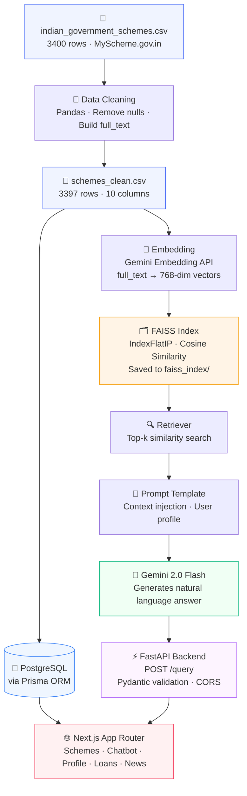
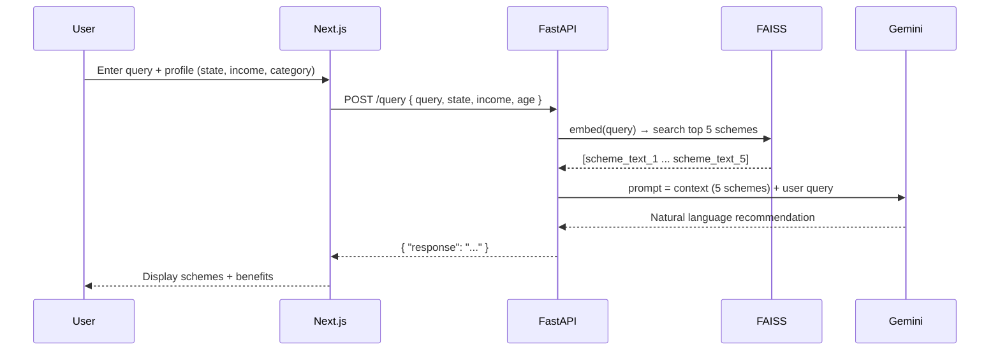

# 🌊 Sangam — AI-Powered Indian Government Schemes Finder

> Find the right government scheme for you — powered by RAG, Gemini & FAISS.

Sangam is a full-stack semantic search + AI recommendation engine built on top
of 3,400+ Indian government schemes sourced from MyScheme.gov.in. Users
describe their situation and get relevant scheme recommendations with key
benefits — no keyword matching, pure meaning-based retrieval.

---

## 🏗️ Architecture



---

## 🧠 How RAG Works Here



---

## 🗂️ Project Structure

```
sangam/
├── app/                          # Next.js frontend (App Router)
│   ├── about/
│   ├── admin/
│   ├── api/                      # Next.js API routes (proxy to FastAPI)
│   ├── chatbot/
│   ├── components/
│   ├── contact/
│   ├── loans/
│   ├── login/
│   ├── news/
│   ├── profile/
│   ├── register/
│   ├── schemes/
│   ├── layout.tsx
│   ├── page.tsx
│   └── globals.css
│
├── prisma/                       # Prisma ORM
│   ├── migrations/
│   ├── schema.prisma             # DB model for Scheme table
│   ├── seed.ts                   # Prisma seeding
│   └── feed_csv.ts               # Bulk-load CSV → PostgreSQL
│
├── DataClearning/                # 🧠 Python ML / RAG pipeline
│   ├── data/
│   │   ├── schemes_clean.csv     # Cleaned dataset
│   │   ├── embeddings.npy        # Pre-computed Gemini vectors
│   │   ├── faiss.index           # FAISS similarity-search index
│   │   └── langchain_faiss/      # LangChain-compatible vectorstore
│   │
│   ├── worldOfRag/               # Step-by-step RAG learning modules
│   │   ├── step1_embeddings.py   # Embed 3 rows & compare cosine similarity
│   │   ├── step2_faiss.py        # Build FAISS index over full dataset
│   │   ├── vectorGenerator.py    # Batch-embed all rows + save to disk
│   │   ├── checkPointvectorGenerator.py  # Batch embed with resume support
│   │   ├── context_injection.py  # Manual RAG: retrieve → inject → Gemini
│   │   └── langchain/
│   │       ├── docstore.py       # Raw FAISS → LangChain vectorstore
│   │       ├── fullLangchain.py  # Full LangChain retrieval chain
│   │       └── pandas_lern.py    # Pandas exploration script
│   │
│   ├── API/                      # FastAPI backend
│   │   ├── Main.py               # FastAPI app (GET /, POST /query)
│   │   ├── business_logic.py     # LangChain RAG chain + LLM logic
│   │   └── user.json             # Sample user profiles for testing
│   │
│   ├── streamlit/
│   │   └── app.py                # Streamlit UI (temp — chat + scheme cards)
│   │
│   ├── clean.py                  # Data cleaning script
│   ├── clean.ipynb               # Data cleaning notebook
│   ├── Makefile                  # Dev shortcuts (make api, make langchain…)
│   └── requirements.txt          # Python dependencies
│
├── context/                      # Next.js context providers
├── lib/                          # Shared libs (Prisma client, etc.)
├── scripts/                      # Misc scripts
├── middleware.ts                 # Next.js auth middleware
├── package.json
├── tsconfig.json
└── README.md
```

---

## 🛠️ Tech Stack

| Layer | Technology |
|---|---|
| Frontend | Next.js (App Router) · TypeScript · Tailwind CSS |
| Auth & Middleware | Next.js middleware · Session handling |
| Database | PostgreSQL · Prisma ORM |
| ML / RAG Pipeline | Python 3.14 · LangChain · FAISS · Gemini Embedding API |
| LLM | Gemini 2.0 Flash |
| Backend AI API | FastAPI · Uvicorn · Pydantic |
| Data Processing | Pandas 3.0.1 · NumPy |
| Temp UI | Streamlit |
| IDE | VS Code · Jupyter Notebook |

---

## 🚀 Setup & Run

### Frontend (Next.js)

```bash
npm install
cp .env.local.example .env.local    # add DB URL, API keys
npx prisma migrate dev
npm run dev                          # runs on localhost:3000
```

### Python RAG Backend (FastAPI)

```bash
cd DataClearning
python -m venv venv
source venv/bin/activate
pip install -r requirements.txt

# Add your Gemini key
echo "GOOGLE_API_KEY=your_key_here" > .env

# Run FastAPI
uvicorn API.Main:app --reload --port 8000
# Swagger docs → http://localhost:8000/docs
```

### Streamlit (temp UI, optional)

```bash
cd DataClearning
streamlit run streamlit/app.py
```

---

## 📡 API Reference

### `GET /`
Health check
```json
{ "status": "Sangam API running" }
```

### `POST /query`
Get scheme recommendations based on query + user profile.

**Request:**
```json
{
  "query": "schemes for small farmers with low income",
  "state": "Gujarat",
  "category": "General",
  "income": 50000,
  "age": 35
}
```

**Response:**
```json
{
  "response": "Based on your profile, here are relevant schemes:\n1. PM-KISAN..."
}
```

---

## 🧭 Build Journey

Built step-by-step to understand every layer before abstracting it:

| Step | File | Key learning |
|---|---|---|
| 1️⃣ Data Cleaning | `clean.py` / `clean.ipynb` | `full_text` column combining all fields for RAG |
| 2️⃣ Manual Embeddings | `worldOfRag/step1_embeddings.py` | What vectors look like, cosine similarity |
| 3️⃣ Manual FAISS | `worldOfRag/step2_faiss.py` | Similarity search without any framework |
| 4️⃣ Batch Embedding | `worldOfRag/vectorGenerator.py` | Embed all 3397 rows, save `.npy` + index |
| 5️⃣ RAG without LangChain | `worldOfRag/context_injection.py` | Manual retrieval + prompt injection |
| 6️⃣ RAG with LangChain | `worldOfRag/langchain/fullLangchain.py` | How LangChain abstracts the pipeline |
| 7️⃣ FastAPI Backend | `API/Main.py` + `business_logic.py` | `/query` endpoint, Pydantic, lifespan |
| 8️⃣ Streamlit UI | `streamlit/app.py` | Temp frontend for demo and testing |

---

## 🗺️ Roadmap

- [x] Data cleaning + `full_text` column
- [x] Manual embedding + FAISS exploration
- [x] Full LangChain RAG pipeline
- [x] FastAPI `/query` endpoint
- [x] Streamlit UI (temp)
- [ ] Connect Next.js `/api/recommend` → FastAPI proxy
- [ ] Profile-aware recommendations from Next.js form
- [ ] Conversational memory (`ConversationBufferMemory`)
- [ ] Filter by ministry / beneficiary type
- [ ] Deploy FastAPI on Railway / Render
- [ ] Deploy Next.js on Vercel

---

## 📦 Dataset

- **Source:** [Kaggle — Indian Government Schemes](https://www.kaggle.com)
- **Original:** 3,400 rows · 11 columns
- **Cleaned:** 3,397 rows · 10 columns
- **Origin:** MyScheme.gov.in

---

## 🙏 Acknowledgements

Built as part of **ImpactTHon** semester project.
Powered by [Google Gemini](https://aistudio.google.com) ·
[FAISS by Meta](https://github.com/facebookresearch/faiss) ·
[LangChain](https://langchain.com) · [Prisma](https://prisma.io)
